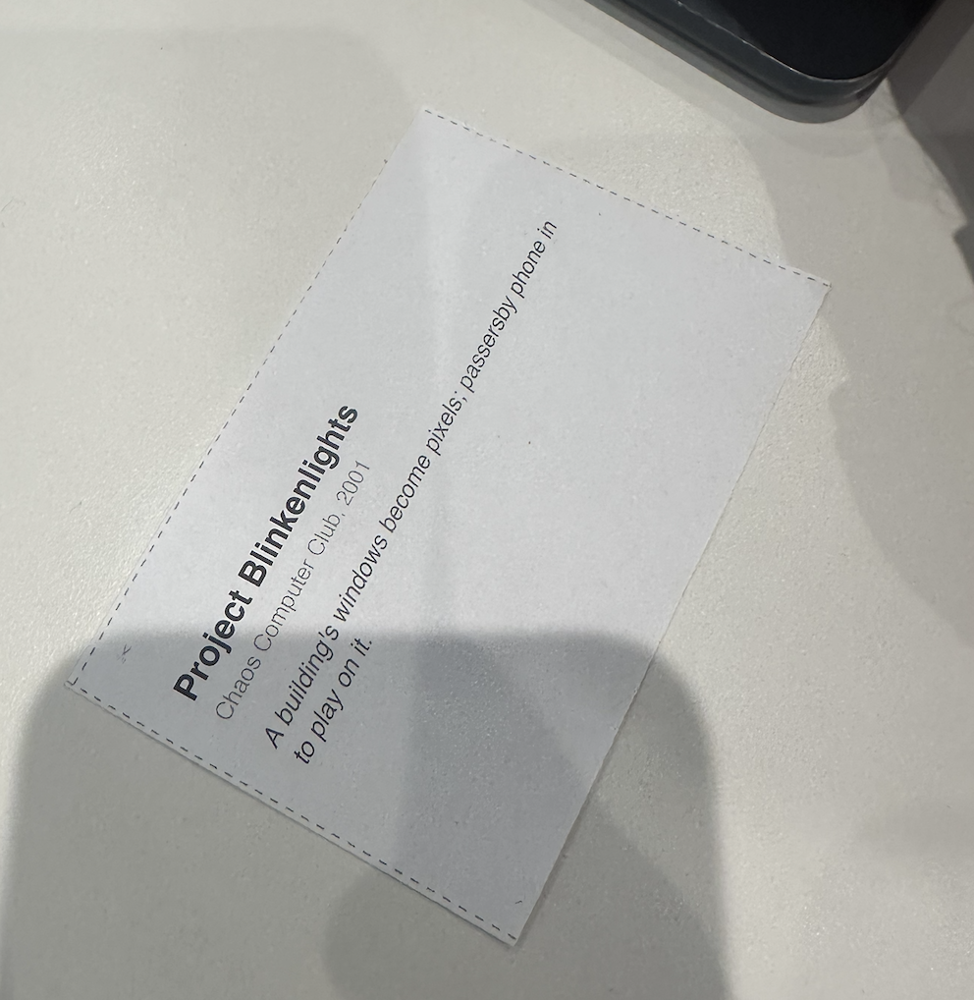
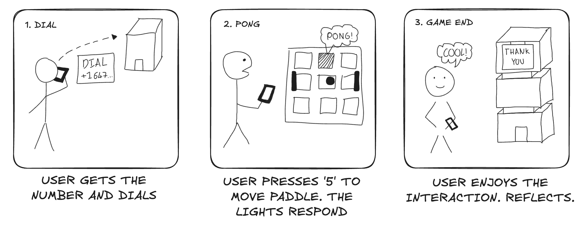
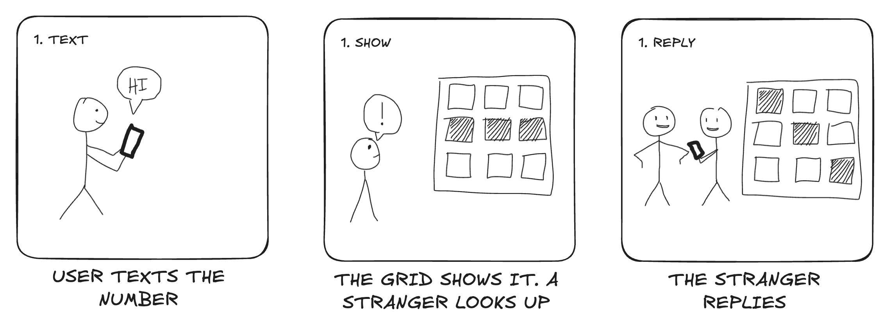
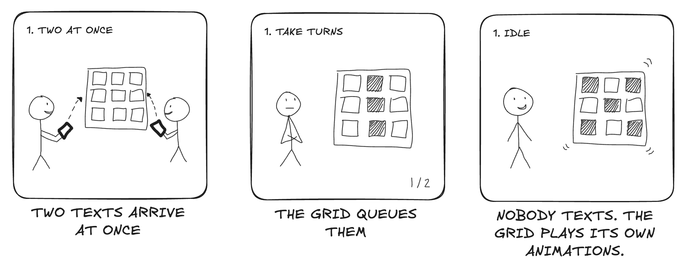
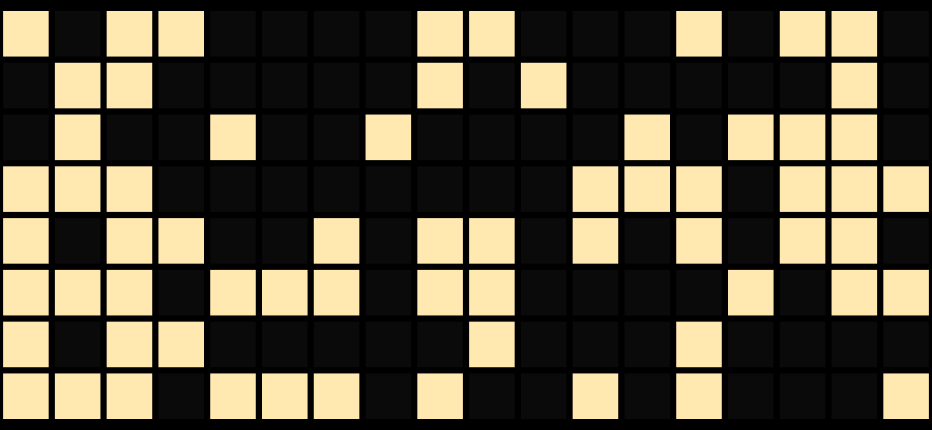

# Recreating the Masters of Interactive Light

**COLLABORATORS:** Elliot Waxman, Ghaith Khalil

**THE MASTERWORK YOU DREW FROM THE HAT:** Project Blinkenlights by the Chaos Computer Club, 2001

---

# The Report

## Part 0. Know Your Master

In 2001 the Chaos Computer Club turned 20. They are a hacker club in Germany. To celebrate they turned a building into a screen. They put a lamp behind every window on the top eight floors of a building on Alexanderplatz in Berlin. That was 144 lamps in an 18 by 8 grid. Each lamp was wired to a relay so a computer could switch it on and off. The whole side of the building became a giant, very low resolution display. It ran every night for about five months and people still talk about it.

**The core interaction:** You call a phone number and play Pong on the building against another caller. You move your paddle with the keys on your phone. You could also send in your own animations and text. A lot of people sent love letters. The game itself is nothing special. What is special is that a whole building is answering the phone in your hand, in front of everyone in the square.

**Strengths:** It made a boring office block feel alive. The input was a phone, and everyone already had one, so anyone walking by could join in. The display was huge and public, so one person's text became a moment for the whole square.

**Weaknesses:** Only two people could play at a time. Everyone else just watched. 144 pixels is tiny, so text had to scroll and anything detailed was impossible. It also needed the building owner's permission, which is why it had an end date.

**Sources:**
- [Project Blinkenlights on Wikipedia](https://en.wikipedia.org/wiki/Project_Blinkenlights)
- [blinkenlights.net, the project archive](http://blinkenlights.net/)

## Part A. Plan

- **Setting:** A long, boring line at night outside a popup restaurant. There is a pixel grid building that everyone in the line can see.
- **Players:** A bored person in the line who sends the text. The strangers around them who watch and can text too. The building's grid of lights.
- **Activity:** Someone texts a number and their message shows up on the grid for the whole line to see. People look up. Someone texts back. The line starts talking to itself through the building.
- **Goals:** The sender wants to be seen and to kill time. The strangers want something to look at, and then they want to reply. The building just wants to keep everyone entertained while they wait.

### Storyboards
**Iteration 1:** A simple visual of the original Blinkenlights interaction. Someone calls the number, plays Pong on the building with their keypad, and the building says thank you when the game ends.  

**Iteration 2:** We swapped the phone call for a text, since that is what people in a line would actually do. The interesting moment turned out to be the stranger next to the sender looking up at the grid and texting back.  

**Iteration 3:** After acting it out in Part B we found two situations the light has to deal with. Two people texting at once, and nobody texting at all. This storyboard covers both.  

**Feedback we got:**

what people liked:
- cool, engaging interaction
- fast, the grid updates right away
- anyone can join from any phone

what could have been better:
- ASCII art
- colors
- smaller letters or a second line
- emojis

## Part B. Act out the Interaction

We acted it out around a table first. A laptop screen stood in for the building. One of us texted and the other played the stranger in line.

When we acted out the sequence, we discovered the following:
- The moment that sells it is not the sender looking at their phone. It is the stranger looking up at the building. The camera needs to be on the line, not on the phone.
- Two people will text at the same time. On paper we had one sender and one grid. In the room, messages ran into each other. The grid needs a queue and some way to show whose turn it is.
- A dark building between messages looks broken, not idle. The grid should keep playing something when nobody is texting so there is always a reason to look up.
- Text on a grid this small has to be short. Long messages scroll forever and people stop watching.

We used these findings to iterate on our storyboard, resulting in Iteration 3 above.

## Part C. Prototype the Light (light first!)

**This week was almost all light.** The one thing that is not light is a short chime the display plays when a message lands. It is on by default in the code. We kept it because the original building had no sound and a silent grid changing behind you is easy to miss in a loud line.

We ended up building our own thing instead of using Tinkerbelle. We call it Pocket Blinkenlights. It is a web page that turns a phone or any screen into an 18 by 8 grid of windows, the same size as the real building. Each cell is one window, on or off, like the original lamps.

What we actually used is texting. Anyone texts a real phone number and the message scrolls across the grid in a 5 pixel wide font. Messages are capped at 80 characters. There is a small profanity filter and a rate limit so one person cannot hog the building. The sender gets a text back saying when their message will show up. Emojis work too, at least the ones that survive being drawn in black and white, like hearts and faces.

When nobody is texting, the grid plays a small set of animations we made, rain, a wave, a heartbeat and a sweep. If it ever runs out, it falls back to random windows flickering on and off like people going to bed. So the building never goes dark.

The code also has phone keypad Pong and a pixel editor for submitting your own animations, since the original had both. We did not use either in our videos. The text mode is the piece.

**Light working, first test:** https://youtube.com/shorts/tsh5MOguhmc?feature=share

That video is the grid on a laptop being driven live from a phone.

**Live page:** https://pocket-blinkenlights.fly.dev

Open it on a phone and turn the phone sideways.

**Code:** https://github.com/Einsight04/pocket-blinkenlights

The live grid, caught mid animation between messages:  

**Feedback on Tinkerbelle:** Tinkerbelle drives one light from a laptop. That is perfect for a lamp or a watch but not for a 144 pixel building. We needed lots of pixels reacting to texts and calls at once, so writing our own small server made more sense. A grid mode in Tinkerbelle, where a message or pattern drives a whole grid of pixels on one phone, would have made it work for a piece like this.

## Part D. Wizard the Device

For the wizarded version we hardcoded a word and made it show up on the grid from the laptop. One of us sat at the keyboard and triggered it. That was the whole setup.

See our wizarded attempt here: https://youtube.com/shorts/yYF0AHQYx-4

This was enough to check that the grid and the scrolling looked right before we hooked up real texts.

## Part E. Costume the Device

We did not costume the device this week. We spent the time on the light itself, getting texts and the idle animations working before worrying about how it looks.

**Concerns/opportunities in shaping the look:** The plan for later is a little building shell for the phone. The screen would show through cut out windows so it reads as a building and not a phone. It has to stand upright, be bright enough to see from the back of a line at night, and hide the edges of the phone. A 3D printed shell is already the next milestone in our code repo.

## Part F. Record

**Video Sketch:** https://youtube.com/shorts/RPhKJcqeU8U?feature=share

**Our aim:** Someone who knows Blinkenlights should recognize the building as a screen and the phone as the controller right away. Someone who has never heard of it should get that a building can answer the phone in your hand, and that the fun is everyone around you seeing it happen.

**Testing it:** We tried it with three people who had not seen the project before. Each of them texted a word or two. The messages queued up, and they stood there watching each other's words scroll in and out while waiting for their own. Nobody tried anything fancy, no emojis, no conversation. Just simple words, and everyone looking at the grid together to see whose was next.

**Collaborators and influences:**
- Elliot Waxman and Ghaith Khalil, an even split. We planned it together, built it together, drew the storyboards, recorded the videos, wrote this up, and traded feedback with the other groups
- The Chaos Computer Club, for the original Blinkenlights and the archive at blinkenlights.net
- The IRL-CT Tinkerbelle tool, which we studied before deciding to build our own grid
- Neeha Ravula and Marisol Park, Rohil Saraf and Aryan Palave, and Gal Alon and Jonathan Sharpy, the three groups who gave us feedback

---

# Part 2 — ReMastering the light

*This describes the second week's work for this lab activity.*

## Prep (before the next lab)

Find three other groups. (How? Maybe Slack?) Visit their Lab Hub pages, watch their
videos, and give them reactions and feedback: tell them what you saw happening,
guess the masterwork and the goals of the characters, and ask about anything that
wasn't clear.

<!-- CHECK: the second and third groups' lines are from our notes but we are not sure who said which -->
**Group 1: [Timex Indiglo](https://github.com/neeharavula/Interactive-Lab-Hub/blob/Fall2026/Lab%201/README.md)** Neeha Ravula and Marisol Park 
what they liked:
- cool, engaging interaction
- fast updates
- works from any phone
what could have been better: 
- ASCII art
- colors

**Group 2: [Light Up Sneakers](https://github.com/ga386-hash/Interactive-Lab-Hub/blob/Fall2026/Lab%201/README.md)** Gal Alon and Jonathan Sharpy 
what they liked:
- cool application, they could see the link to the masterwork through the live text feed
what could have been better: 
- smaller letters or a second line

**Group 3: [E.T.'s Glowing Heart](https://github.com/rohilsaraf97/Interactive-Lab-Hub/blob/Fall2026/Lab%201/README.md)** Rohil Saraf and Aryan Palave 
what they liked:
- the real time text feed
what could have been better: 
- emojis

## Remix, Update, or Critique the Master

Now that you understand your masterwork from the inside, respond to it. Do the
recreation again, but this time make it your own — pick one of these moves (or
combine them):

1. **Remix the modality.** Your recreation no longer has to (just) use light. Use
   vibration, sound, motion, heat — whatever best carries the interaction. Feel
   free to fork and modify the Tinkerbelle code. (Add your updates to this lab's folder!)
2. **Update it.** Redesign the piece for today's context, or for a setting its
   creators never imagined (the piece with roommates in the room, with children
   present, on a phone, in a car).
3. **Fix its weaknesses.** You identified this master's strengths and weaknesses
   in Part 0 — now address a weakness, or push a strength further.

We will grade this second pass with an emphasis on **creativity** and on how well
your response engages with what your master was really doing.

**Document everything here — especially the storyboard and video. Photos of the
prototype are great too.**

---

*Assignment lineage: this lab merges "Staging Interaction" (Interactive Lab Hub)
with "Recreating the Masters" (Interaction Design Studio, Profs. Scott Minneman &
Wendy Ju). Massive list of interactive light masterworks generated by Claude.ai.*
