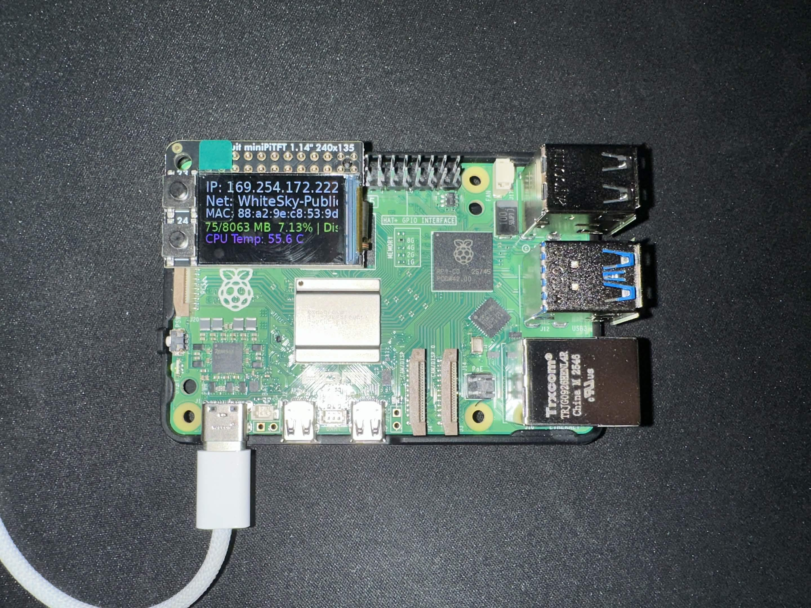
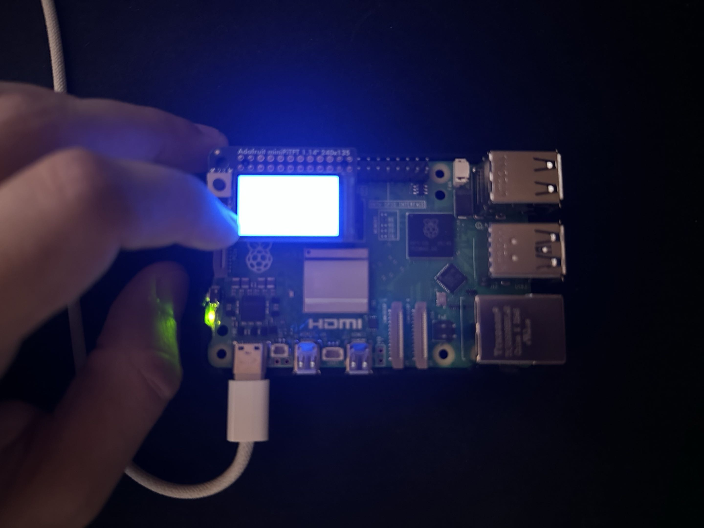
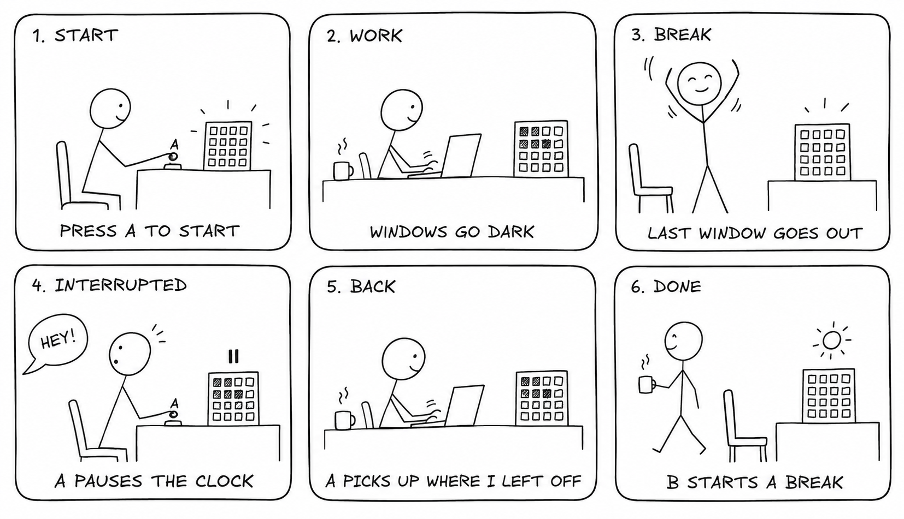

# Interactive Prototyping: The Clock of Pi

**Ghaith Khalil — One More Window**

One More Window is a Pomodoro timer shown as a little building. Its 25 windows go dark one at a time during a work session. When the last light goes out, it is time to step away. During the five-minute break, the windows fill back up.

## Prep

Checked the hardware and [kit inventory](partslist.md). The project uses a Raspberry Pi 5 and an Adafruit Mini PiTFT display with two buttons.

## Part A. Connect to your Pi

Connected to `ghaith-pi.local` over SSH using USB networking. The Python environment is `/home/pi/venv`, and the repository is cloned to `/home/pi/lab-hub`.

## Part B. Try out the Command Line Clock

Ran [cli_clock.py](cli_clock.py) on the Pi. It prints the date and time once per second on the same terminal line. [Terminal output](evidence/cli-clock.txt).

## Part C. Set up your RGB Display

The startup screen shows the Pi's network information and MAC address, **88:a2:9e:c8:53:9d**.

Stopped `piscreen.service` before running [screen_test.py](screen_test.py), so only one program controlled the display. Selected blue: the top button shows white, the bottom button shows blue, and holding both turns off the backlight.

The photo shows the bottom button held during the blue test. The camera washes out the center, but the blue light is visible around the screen.

## Part D. Set up the Display Clock Demo

Completed [screen_clock.py](screen_clock.py). Each second it clears the frame, draws the current time and date, and sends the image to the display.

## Part E. Sketch and brainstorm further interactions and features

Three ideas:

- **One More Window:** a building empties as a work session passes. The last window going dark means it is time to stop.
- **Cold Coffee:** a cup loses its steam over a session. Simple, but steam could be hard to read on a tiny display.
- **Last Train:** a train approaches a platform as a deadline gets closer. Clear urgency, but it might make a desk feel more stressful.

The building gives time a visible quantity: occupied rooms. One window goes dark each minute. The amount of light gives a sense of how much work time remains without a numerical countdown.

### Storyboards

The top row shows the initial interaction: start, work, step away. The bottom row adds interruptions: pause, return, and deliberately begin a break.

### Interaction sketch: do, feel, know

| | Work session | Interruption | Break |
|---|---|---|---|
| **Do** | Press A, then work | Press A to pause; A again to resume | Press B when ready to leave the desk |
| **Feel** | The building gradually gets quieter | The remaining lights hold still | Teal windows fill back up |
| **Know** | Fewer lights means closer to stopping | “PAUSED” means time is not being consumed | “READY?” means the break has finished |

**Setting:** a desk during homework. **Person:** someone who keeps saying “one more thing.” **Goal:** make stopping feel like finishing something rather than abandoning it.

### Peer feedback

[Feedback sent to Neeha Ravula, Gal Alon, and Rohil Saraf](peer-review.md). Incoming feedback is pending.

# Lab 2 Part 2

## Modify the barebones clock to make it your own

The first implementation, [window_sweep.py](window_sweep.py), starts immediately and turns off one window per minute. It tests the visual idea before adding button controls.

## Make a short video of your modified barebones PiClock

https://github.com/user-attachments/assets/294393de-7d3e-4b21-b23d-9293c251a5db

This 26-second recording shows the actual Pi's windows going dark and ends on “STEP AWAY.” Demo mode turns off one window per second instead of one per minute.

## Now, make your own PiClock

The final implementation is [window_clock.py](window_clock.py). It adds pause/resume and a separate break phase. Interruptions no longer mean losing the session, and the break waits until the user is ready to begin it.

| Input or event | Result |
|---|---|
| A, before starting | Start a 25-minute work session |
| A, during work or break | Pause or resume |
| Work finishes | Hold the empty building and show “STEP AWAY” |
| B | Switch to a fresh break or work session and start it |
| Break runs | Fill the windows over five minutes |
| Break finishes | Hold the full building and show “READY?” |
| Both buttons held for one second | Reset to the idle work screen |

B can also end a session early. Text labels and opposite fill directions distinguish work from break as well as color. There is no alarm or automatic restart. Restarting the program resets the session.

The timer uses a monotonic clock so changes to the system time do not affect the session. Button inputs are debounced, and holding both buttons suppresses accidental single-button actions. The [startup service](window-clock.service) runs the clock on boot.

### Final video

https://github.com/user-attachments/assets/8c854c35-7e04-4a99-8e9d-22fec76287d2

This 38-second recording uses a 25-second work session and a five-second break. It demonstrates the interaction and ends on “READY?”

## Contributions and influences

I planned the project, checked the hardware, operated the prototype, and recorded the photos and videos. AI helped me with planning and code. The IRL-CT starter and Adafruit examples provided the display setup. Pocket Blinkenlights from Lab 1 inspired the building metaphor and sketch style.
