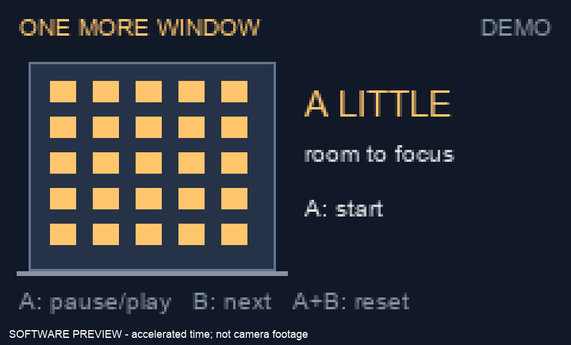

# Interactive Prototyping: The Clock of Pi

**Ghaith Khalil — One More Window**

A little building that tells you when to stop working.

Lab 1 turned a building into a screen. This time the building sits on a desk. Its windows go dark one at a time during a work session. When the last light goes out, it is time to step away. No ticking numbers and no alarm.

**Status:** The implementation, concept sketches, software demo, and automated Pi checks are complete. Ghaith has confirmed the hardware checks are complete. Both hardware photos are included below. The basic-prototype hardware video is included. The final interaction video and three peer feedback exchanges remain outstanding. See the [evidence checklist](evidence/README.md). The animation below is a software preview, not a recording of the device.



## Prep

The original brief is preserved in [assignment.md](assignment.md). The [main lab hub](../README.md) links here. [Parts inventory](partslist.md) records the automated checks and Ghaith’s confirmation that the hardware checks are complete.

## Part A. Connect to your Pi

Connected over USB networking using the existing SSH alias `pi`, which resolves to `ghaith-pi.local`. The device reports Raspberry Pi 5 Model B Rev 1.1. The existing Python environment is `/home/pi/venv`. The repository is cloned to `/home/pi/lab-hub`.

GitHub operations use the existing authenticated account on the laptop. No account password or access token is stored in this repository.

[Device evidence](evidence/pi-environment.txt).

## Part B. Try out the Command Line Clock

Ran the supplied [cli_clock.py](cli_clock.py) on the Pi. It prints the date and time once per second on the same terminal line. [Captured output](evidence/cli-clock.txt).

## Part C. Set up your RGB Display

The Pi has SPI devices available, and `piscreen.service` was running when connected. Its Wi-Fi MAC is **88:a2:9e:c8:53:9d**. The service was stopped before testing the other display scripts so two programs would not write to the screen at once.

The supplied [screen_test.py](screen_test.py) was run with blue selected. Its controls are A for white, B for blue, and both for backlight off. A bounded automated run checks driver execution; it does not verify those physical presses or the visible colors. [Run results](evidence/display-checks.txt).

The actual Pi running `piscreen.service`, photographed by Ghaith. The displayed MAC matches the device checked over SSH.


The color test with blue selected and the lower button held, photographed by Ghaith. The camera overexposes the center of the display; blue light is visible around its edges.


## Part D. Set up the Display Clock Demo

Completed the missing drawing code in [screen_clock.py](screen_clock.py). Each second it clears the frame, draws the current time and date, and sends the image to the display. This is the literal clock exercise before moving to the building concept.

## Part E. Sketch and brainstorm further interactions and features

Three directions:

- **One More Window:** a building empties as a work session passes. The last window going dark means the work is done for now.
- **Cold Coffee:** a cup loses its steam over a session. Simple, but steam is hard to make readable on a tiny display.
- **Last Train:** a train approaches a platform as a deadline gets closer. Clear urgency, but it might make a desk feel more stressful.

The building keeps the connection to Lab 1 and gives time a physical quantity: occupied rooms. There are 25 windows. During a normal 25-minute work session, one goes dark each minute. You can glance at the amount of light instead of reading an exact remaining time.

### Storyboards

The top row shows the first idea: start, work, step away. The bottom row adds the interruption case: pause, return, deliberately begin a break. These are proposed interactions, not observations from a user test. The drawings are AI-generated in the rough visual style of the Lab 1 reference.


### Interaction sketch: do, feel, know

| | Work session | Interruption | Break |
|---|---|---|---|
| **Do** | Press A, then work | Press A to pause; A again to resume | Press B when ready to leave the desk |
| **Feel** | The building gradually gets quieter | The remaining lights hold still | Teal windows fill back up |
| **Know** | Fewer lights means closer to stopping | “PAUSED” means time is not being consumed | “READY?” means the break has finished |

**Setting:** a desk during homework. **Person:** someone who keeps saying “one more thing.” **Goal:** make stopping feel like finishing something, rather than abandoning it.

### Peer review

The same contacts from Lab 1 were located through the class forks: Neeha Ravula, Gal Alon, and Rohil Saraf. Their Lab 2 pages describe a Spider-Verse clock, deadline/water clocks, and a Snack Clock. [Specific feedback drafts and source links](peer-review.md) are ready. These have not been sent, and there is no verified feedback from them on this project yet. Lab 1 collaborators are not automatically credited as Lab 2 collaborators.

# Lab 2 Part 2

## Prep

The remaining feedback requirement is three real exchanges. The questions to test are simple: What do the windows mean? Can you tell paused from finished? Would you expect the break to start automatically? Record the replies in [peer-review.md](peer-review.md).

## Modify the barebones clock to make it your own

The first implementation is [window_sweep.py](window_sweep.py). It starts a work session immediately and turns off one window per minute. It uses the shared display renderer but hides the final version's button hints. This pass isolates the visual idea before adding interaction.

```sh
cd /home/pi/lab-hub/'Lab 2'
/home/pi/venv/bin/python window_sweep.py --demo
```

The accelerated mode turns off one window per second. Without `--demo`, the session lasts 25 minutes.

## Make a short video of your modified barebones PiClock

[Watch the basic prototype on the actual Pi](evidence/pi-basic-demo.mp4). Recorded by Ghaith, this 26-second clip shows the windows going dark and ends on “STEP AWAY.” The prototype runs in accelerated demo mode: one window per second instead of one per minute.

## Now, make your own PiClock

The final implementation is [window_clock.py](window_clock.py).

The first version only emptied the building. The refined version handles leaving in the middle, coming back, and deciding when a break actually begins. The storyboard's bottom row shows those changes. These refinements came from design reasoning with AI, not claimed peer testing.

| Input or event | Result |
|---|---|
| A, before starting | Start a 25-minute work session |
| A, during work or break | Pause or resume |
| Work finishes | Hold the empty building and show “STEP AWAY” |
| B | Switch to a fresh break or work session and start it immediately |
| Break runs | Fill the windows over five minutes |
| Break finishes | Hold the full building and show “READY?” |
| Both buttons held for one second | Reset to the idle work screen |

B can also end a session early. There is no sound, network dependency, or automatic pressure to start working again. Text labels and opposite fill directions distinguish work from break as well as color. Restarting the program resets the session; persistence is not implemented.

The timer uses `time.monotonic()` so a wall-clock correction does not consume or add session time. Button edges are debounced, and a two-button reset suppresses accidental single-button actions. Images are sent only when the frame changes.

### Run it

Stop the startup clock before running a script manually:

```sh
sudo systemctl stop window-clock.service piscreen.service
cd /home/pi/lab-hub/'Lab 2'
/home/pi/venv/bin/python window_clock.py
# Or use a 25-second work / 5-second break for recording:
/home/pi/venv/bin/python window_clock.py --demo
```

The installed [service](window-clock.service) starts the normal clock on boot. It is active with zero restarts at verification ([status](evidence/service-status.txt)). After a manual test, use `sudo systemctl start window-clock.service`. To restore the original network-information screen, stop `window-clock.service` and start `piscreen.service`.

### Checks and video

Eight [automated tests](test_window_clock.py) cover pause accounting, completion, phase changes, reset, invalid durations, frame generation, button bounce, and two-button gestures. They pass on the laptop and Pi. A 28-second accelerated hardware run exercises the display driver through the work-session completion. [Pi log](evidence/pi-smoke-test.txt).

[Watch the accelerated software demo](evidence/software-demo.mp4). The same renderer produces the on-device frames. This file demonstrates the state sequence, including pause and break, but does not replace the required camera video of the Pi. Ghaith subsequently confirmed that the hardware checks are complete; this confirmation is separate from the automated test evidence.

## Contributions and influences

- **Ghaith Khalil:** supplied the Lab 1 reference, project direction, repository, and connected Pi.
- **OpenAI Codex:** proposed the clock concept; implemented and tested the software; accessed the Pi; prepared this report and unsent peer-review drafts. Built-in image generation produced the storyboard using the Lab 1 drawing as a style reference. [Generation prompt](images/storyboard-prompt.txt).
- **Lab 1 / Pocket Blinkenlights:** the building-as-display idea and visual reference. Elliot Waxman is credited in Lab 1; no new Lab 2 contribution from him is claimed here.
- **IRL-CT course starter and its Adafruit-based examples:** SPI configuration, display setup, CLI clock, and the starting Part D file. The shared hardware adapter retains their pin configuration.
- **Classmates' linked repositories:** reviewed for peer-feedback drafts. Their concepts and comments are not presented as original work or as conversations that occurred.
