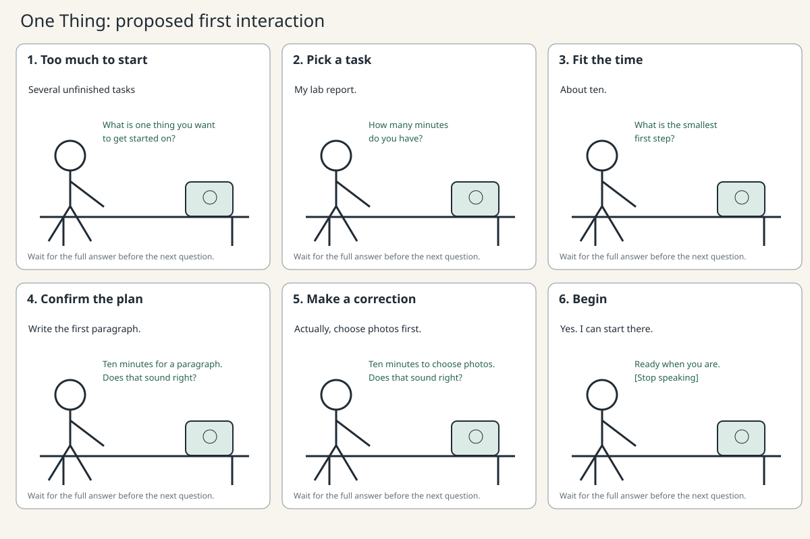

# One Thing: a voice desk coach

**Proposed design for the first interaction study.**

When several tasks feel overwhelming, One Thing helps turn one of them into a small action that fits the time available. It asks one question at a time and confirms the plan before the user begins.

## Storyboard

| Scene | Person | Device |
| --- | --- | --- |
| 1. Stuck at the desk | Looks at several unfinished tasks and asks for help starting. | “What is one thing you want to get started on?” |
| 2. Choose something | “I have to work on my lab report.” | Waits for the full response, then asks how many minutes are available. |
| 3. Make it manageable | “About ten.” | “What is the smallest first step you could take?” |
| 4. Confirm | “Write the first paragraph.” | “Ten minutes to draft the first paragraph. Does that sound right?” |
| 5. Correct or begin | “Actually, I should choose the photos first.” | Revises the plan and confirms it again. |
| 6. Start | Agrees and begins the selected task. | “Ready when you are.” Stops speaking. |

## Dialogue and pauses

The following is an anticipated example, not a record of a participant session.

**Device:** What is one thing you want to get started on?  
**[Wait for speech. Allow at least 0.8 seconds of silence after the answer. Allow longer if the person seems to be thinking.]**  
**Person:** My lab report.  
**Device:** How many minutes do you have?  
**[Wait for the whole numerical response, then 0.8 seconds.]**  
**Person:** Ten.  
**Device:** What is the smallest first step you could take?  
**[Wait. Do not fill a thinking pause immediately.]**  
**Person:** Write the introduction... actually, choose the photos first.  
**Device:** Ten minutes to choose the photos. Does that sound right?  
**[Wait for confirmation or correction.]**  
**Person:** Yes.  
**Device:** Ready when you are. You can begin, or tell me what to change.

The initial 0.8-second threshold is a starting assumption to compare against the Part C experiments. In the wizard study, the designer uses context rather than enforcing it as a hard cutoff. After about five seconds with no answer, ask once, “Would you like more time?” Then wait. If the user says stop, end the conversation immediately.

## Alternative responses to try

- Unclear number: “Was that fifteen or fifty minutes?” Confirm rather than guess.
- Too large a step: “What could you do in just the first two minutes?”
- No task in mind: “Would you like to start with study, chores, or something else?”
- Correction: repeat the corrected plan and ask for confirmation.
- Already finished: “Would you like another step, or are you done for now?”

## How to run the first study

Tell the participant: “This helps you choose a small next step. Try it using something you actually need to do.” Do not show them this dialogue. Use menu option 9 and type custom replies when the presets do not fit. Record the interaction with permission, then ask what they thought the device could understand and where they felt interrupted or stuck.

The keyboard controller speaks through Piper on the Pi. The designer hears the participant and chooses the response. Automatic transcription and VAD are separate experiments at this stage. The controller saves the actual device replies, but it does not claim to understand speech autonomously.

## Evidence to collect

Record the participant's actual words around a misunderstanding, the response chosen, pauses that felt too long or too short, and at least one proposed revision. Use this evidence to design Part 2's visible states and revised dialogue.
