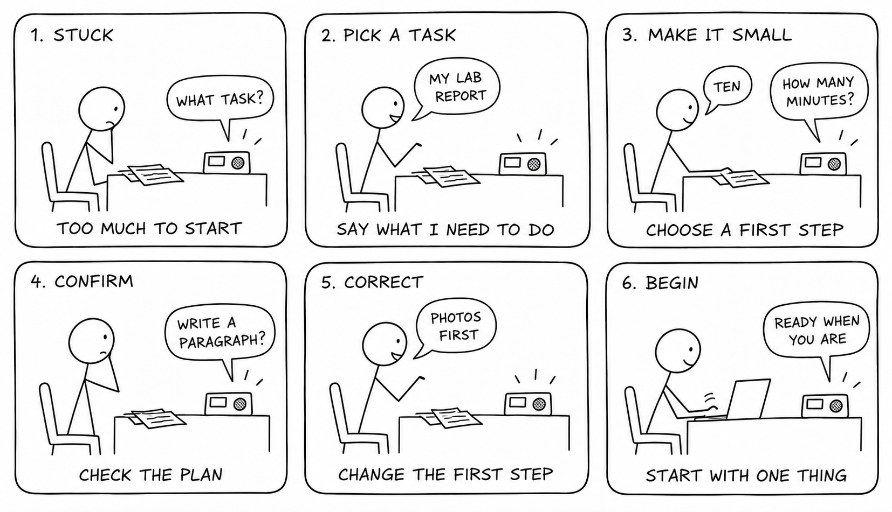

# Chatterboxes: One Thing

**Ghaith Khalil**

One Thing is a voice desk coach for the moment when several tasks feel overwhelming. It helps turn one task into a small next action that fits the time available. Instead of planning an entire day, the conversation ends with one concrete thing to start.

[Setup and in-class checklist](CLASS.md)

The software and initial design are prepared. Pi audio checks, measured results, and participant sessions are still pending.

## Part 1

### A. Text to speech

The greeting in [greet.sh](greet.sh) is: “Hello Ghaith. Let's find one small thing to start with today.” The script uses Piper with the `en_US-lessac-medium` voice and plays the generated WAV through the speaker. Menu option 2 compares that exact wording in espeak-ng, Festival, and Piper.

Piper is the initial voice choice for the prototype. The aim is a calm, conversational prompt rather than an alarm or announcement. The final choice will depend on listening to the voices on the actual speaker.

**Is the same greeting in different voices the same greeting?** The words stay the same, but pace, emphasis, and intonation can change whether the invitation feels patient, commanding, or mechanical. A concrete observation from the three-voice listening comparison is pending.

### B. Speech to text

[exercises.py](exercises.py) records five seconds of speech at 16 kHz, mono, PCM 16-bit. It runs the same recording through `tiny.en` and `base.en` with CPU int8 inference and beam size 1. The transcript is fully consumed before stopping the timer. Model loading is timed separately.

**Real-time factor = transcription time / recording duration.** A value below 1 means transcription took less time than the recording's duration. It does not include the wait for the person to finish speaking, model loading, or spoken response generation.

| Model | Recording length | Transcription time | Real-time factor | Transcription errors |
| --- | --- | --- | --- | --- |
| tiny.en | Pending recording | Pending measurement | Pending measurement | Pending comparison |
| base.en | Same recording | Pending measurement | Pending measurement | Pending comparison |

The exact spoken sentence and both transcripts will be added with the measured results. The accuracy-versus-delay conclusion is pending that comparison. For this design, errors in the task or the number of minutes matter because they change the proposed plan.

**Numerical input script:** menu option 4 runs `exercises.py number`. The Pi says, “How many minutes do you have for one small task?” Pressing Enter starts a five-second recording. The script saves the WAV, recognized answer, actual words entered for comparison, and transcription timing. It records an answer without automatically treating the recognized number as correct.

### C. Turn-taking

Menu options 5, 6, and 7 run Silero VAD with silence thresholds of 0.2, 0.8, and 1.5 seconds. The comparison uses the same phrase with a thinking pause: “I want to start... my reading.” A second attempt includes a correction: “Ten... actually, fifteen minutes.”

| Silence threshold | What to observe | Actual observation |
| --- | --- | --- |
| 0.2 seconds | Whether thinking pauses or corrections split the response | Pending Pi experiment |
| 0.8 seconds | Whether the whole answer is retained without an awkward wait | Pending Pi experiment |
| 1.5 seconds | How the delay after finishing changes the device's apparent responsiveness | Pending Pi experiment |

The initial dialogue uses 0.8 seconds as a starting assumption. The experiment will determine whether it suits this task. Menu option 8 runs the complete listen, transcribe, and echo loop so the combined delay can be heard.

### D. Design and storyboard

Three possible directions were a speaking Pomodoro timer, a checklist reader, and a next-step coach. The coach gives speech a more useful role: a person can explain uncertainty, revise the task, and correct a number instead of only issuing a fixed command.

The first design follows task, available time, smallest step, and confirmation. Explicit confirmation makes corrections part of the interaction. The device stops speaking once the person is ready to begin.

### Storyboard

| Scene | Person | Device |
| --- | --- | --- |
| 1. Stuck at the desk | Looks at several unfinished tasks and asks for help starting. | “What is one thing you want to get started on?” |
| 2. Choose something | “I have to work on my lab report.” | Waits for the full response, then asks how many minutes are available. |
| 3. Make it manageable | “About ten.” | “What is the smallest first step you could take?” |
| 4. Confirm | “Write the first paragraph.” | “Ten minutes to draft the first paragraph. Does that sound right?” |
| 5. Correct or begin | “Actually, I should choose the photos first.” | Revises the plan and confirms it again. |
| 6. Start | Agrees and begins the selected task. | “Ready when you are.” Stops speaking. |

### Dialogue and pauses

The following is an anticipated example, not a record of a participant session.

**Device:** What is one thing you want to get started on?  
**[Wait for speech. Allow at least 0.8 seconds of silence after the answer. Allow longer if the person seems to be thinking.]**  
**Person:** My lab report.  
**Device:** How many minutes do you have?  
**[Wait for the whole numerical response, then 0.8 seconds.]**  
**Person:** Ten.  
**Device:** What is the smallest first step you could take?  
**[Wait. Do not fill a thinking pause immediately.]**  
**Person:** Write the introduction... actually, choose the photos first.  
**Device:** Ten minutes to choose the photos. Does that sound right?  
**[Wait for confirmation or correction.]**  
**Person:** Yes.  
**Device:** Ready when you are. You can begin, or tell me what to change.

The initial 0.8-second threshold is a starting assumption to compare against the Part C experiments. In the wizard study, the designer uses context rather than enforcing it as a hard cutoff. After about five seconds with no answer, ask once, “Would you like more time?” Then wait. If the user says stop, end the conversation immediately.

### Alternatives

- Unclear number: “Was that fifteen or fifty minutes?” Confirm rather than guess.
- Too large a step: “What could you do in just the first two minutes?”
- No task in mind: “Would you like to start with study, chores, or something else?”
- Correction: repeat the corrected plan and ask for confirmation.
- Already finished: “Would you like another step, or are you done for now?”

### E. Acting out the dialogue

The participant will receive this introduction: “This helps you choose a small next step. Try it using something you actually need to do.” The dialogue and operator controls stay out of their view. The operator selects or types device replies after hearing the participant's full response.

The interaction will be recorded with permission. Afterward, the participant will be asked where they felt interrupted or stuck, whether the proposed step was useful, and what they thought the device could understand.

**Interaction video:** pending.  
**Difference between the imagined and actual dialogue:** pending the first partner session.  
**Revision based on that session:** pending.

## Part 2

### Prototype and additional modality

The prepared prototype uses a Raspberry Pi 5, USB microphone, USB speaker, and optionally the existing Mini PiTFT. [wizard.py](wizard.py) is the controller. The operator listens to the person, chooses a preset or writes a custom reply, and Piper speaks it through the Pi. The voice stays loaded between turns to avoid reloading it for every reply.

The microphone can record the interaction to a local WAV. Timestamped events capture device states, spoken replies, synthesis time, and operator notes. The operator supplies the dialogue decisions; this is a Wizard of Oz prototype, not an autonomous assistant. Whisper and VAD are used in the separate speech experiments.

The optional display in [status_display.py](status_display.py) adds text and color:

| State | Screen message | Meaning |
| --- | --- | --- |
| Loading | GETTING READY | Voice is loading |
| Listening | LISTENING / Your turn | The operator is waiting for the participant |
| Thinking | THINKING / Please wait | The operator is deciding, or a reply is being synthesized |
| Speaking | SPEAKING / My turn | The Pi is playing a reply |
| Idle | ONE THING / Ready when you are | No active conversation |

“Listening” indicates the conversational turn, not the microphone recording status. If recording is enabled, it runs throughout the session, including device replies. `/think` and `/listen` let the operator explicitly change the state; speaking and synthesis states change automatically. This makes the intended turn visible without relying on color alone.

[screen_session.sh](screen_session.sh) temporarily stops an active Lab 2 screen service and restores it when the session ends. It reuses the installed Lab 2 display environment. The screen integration is prepared but has not yet been checked on the Pi.

This is an initial implementation. A revised storyboard and dialogue must still follow the actual Part 1 findings.

### Controller

| Input | Action |
| --- | --- |
| 1 / 2 / 3 | Ask for a task / available minutes / smallest step |
| 4 | Ask the person to repeat |
| 5 | Offer a smaller step or different task |
| 6 | Invite the person to begin |
| 7 | Say the conversation can stop |
| 8 | Ask whether more thinking time is needed |
| Any other text | Speak a custom response, including a confirmation or correction |
| `/think` / `/listen` | Change the visible conversational state |
| `/note text` | Save an observation without speaking it |
| `/quit` | End the session and close the recording |

After speaking the stop reply, the operator ends the session with `/quit`. Microphone recording requires an affirmative answer to the permission prompt. Session files remain local in `results/` and are excluded from Git. Each session saves a label and a snapshot of the dialogue prompts used. Menu option 12 saves an observed problem and a before/after wording change, which the next controller session loads automatically. This allows the initial and revised versions to be distinguished in the evidence.

**System video:** pending hardware session.  
**Controller video or screen recording:** pending hardware session.

### User testing

| Session | Interaction and evidence | Findings and resulting change |
| --- | --- | --- |
| Participant 1, revised prototype | Pending | Pending |
| Participant 2, revised prototype | Pending | Pending |

**What worked well about the system and what didn't?** Pending actual interactions. The study will check whether the next step feels manageable and whether confirmation handles corrections clearly.

**What worked well about the controller and what didn't?** Pending operator use during the study. The main questions are whether preset replies are sufficient and whether typing a custom confirmation creates noticeable silence.

**What lessons can you take away from the WoZ interactions for designing a more autonomous version?** Pending the observed interactions. The recordings and event logs will help identify useful clarification questions, corrections, and tolerable response delays before selecting an autonomous dialogue policy.

**How could this create a dataset of interaction? What other sensing modalities make sense?** Each session can pair microphone audio with elapsed timestamps for device replies and state transitions. After the study, turns could be annotated as task choice, duration, clarification, correction, confirmation, or stop. The microphone also captures the speaker, so device turns must be distinguished using the event log and audio. A synchronized video could add visible hesitation and attention to the display. A physical confirmation button could provide an explicit event when speech is ambiguous. Only recordings participants agree to share should be published.

### Evidence collection

Menu option 11 saves experiment observations, and option 13 saves the actual findings from each participant session. [evidence.py](evidence.py) combines those notes, revision records, and measured recognition results into a local `results/report-evidence.md` worksheet through option 14. Missing results remain pending. [collect.sh](collect.sh) backs up the Pi results to the laptop without deleting the originals. These tools collect evidence; they do not replace the final interpretation or the interaction videos.

## Contributions and influences

AI helped me with planning and code. The [IRL-CT Lab 3 starter](https://github.com/IRL-CT/Interactive-Lab-Hub/tree/Fall2026-shadow/Lab%203) provided the speech exercises and setup. The display uses the Mini PiTFT setup from Lab 2. One Thing extends the focus-on-work theme into choosing how to begin.
