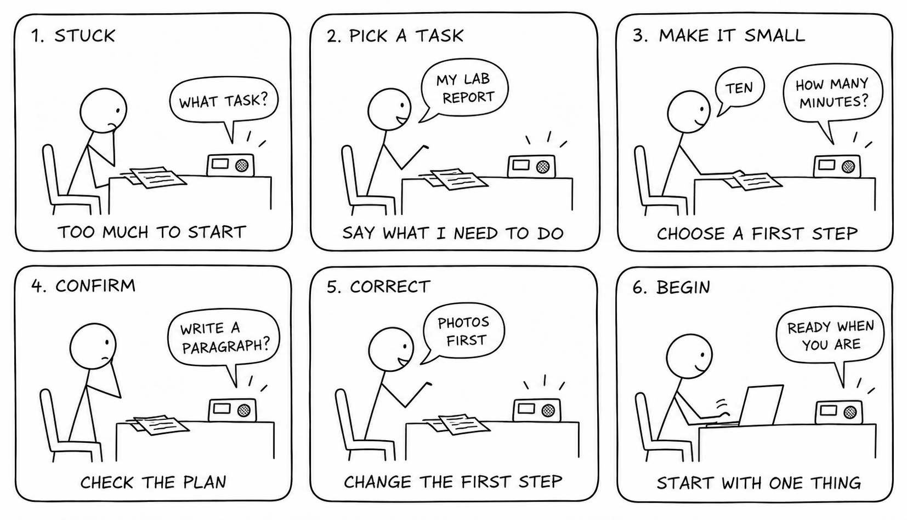

# Chatterboxes

**Ghaith Khalil and TODO (partner): One Thing**

One Thing is a voice desk companion for the moment when there is too much to do and nothing gets started. It asks what you want to work on, how much time you have, and what the smallest first step is. Then it stops talking so you can start. The conversation ends with one concrete thing to do, not a plan for the whole day.

## Prep

The project uses a Raspberry Pi 5 with a USB microphone and a USB speaker, set up following [prep.md](prep.md). Part 2 uses the USB microphone as its sensor and the Mini PiTFT from Lab 2 for turn-taking cues. An APDS-9960 proximity sensor is optional; it was not detected on the connected Pi.

```
cd ~/lab-hub/Lab\ 3
python3 -m venv --system-site-packages .venv && source .venv/bin/activate
pip install -r requirements.txt
./speech-scripts/setup.sh
```

The Pi detects the USB PnP Sound Device microphone and UACDemoV1.0 speaker. ALSA routes capture and playback to those devices by name, so the setup does not depend on their card numbers. Hardware checks completed on the Pi: Piper synthesized and played a setup message, the microphone returned 16,000 samples without overflow, and the controller initialized the Mini PiTFT and microphone together.

---

# Part 1

## A. Text to Speech

[greet.sh](greet.sh) greets each of us by name (`./greet.sh Ghaith`) with Piper (`en_US-lessac-medium`), streamed straight to the speaker so it starts talking before the whole sentence is synthesized:

> "Hello Ghaith. Let's find one small thing to start with today."

`./greet.sh Ghaith compare` plays the same greeting in espeak, festival, and then Piper.

**Is the same greeting, in these different voices, the same greeting?**

**TODO:** after listening on the speaker. One concrete way the voice changed what the greeting meant or who seemed to be speaking.

## B. Speech to Text

**Real-time factor for our own recording**

[Listen to the microphone recording](audio/own-speech.wav)

The recording is nine seconds long, including the short silence before and after the sentence. The intended sentence was: "I have fifteen minutes to work on my lab report. First, I will choose the photos."

Both models ran on the Raspberry Pi 5 with int8 computation and beam size 1. Timing excludes model loading and includes consuming the complete transcription result. Real-time factor is transcription time divided by the full nine-second recording.

| Model | Transcript | Transcription time | Real-time factor |
| --- | --- | --- | --- |
| tiny.en | I have 15 minutes to work on my lab report. First I'll choose the photos. | 1.271 s | 0.141 |
| base.en | I have 15 minutes to work on my lab report. First I will choose the photos. | 2.067 s | 0.230 |

**At what point does the accuracy improvement stop being worth the delay?**

For this recording, base.en took about 0.80 seconds longer without changing any information the device needs: both captured the task, fifteen minutes, and choosing photos. The only wording difference was "I'll" versus "I will." On this example, tiny.en is the better starting point for a responsive conversation. One recording does not establish that it is equally accurate for other voices, background noise, or corrections; those are cases to test before choosing a model for a finished device.

**Asking for a number:** [ask_number.py](ask_number.py) asks out loud, *"How many minutes do you have for one small task?"*, records until the answer ends (Silero VAD, 0.8 s of silence), transcribes it with faster-whisper, and reads the number it heard back to the person. Each answer is saved to `results/` as audio, plus a row in `numbers.csv` with the transcript and the number extracted from it. `--question` asks something else, for example a zip code.

The script lists every number in the answer instead of guessing one, so "ten... actually, fifteen" is saved as `10 15`. That is the kind of correction the device has to handle.

**TODO:** the characteristic errors seen on digit strings (for example "fifteen" vs "fifty", or a phone number).

## C. Turn-taking

`python speech-scripts/listen.py --min-silence <seconds>`, using two test phrases that include a thinking pause:

- "I want to start... my reading."
- "Ten... actually, fifteen minutes."

| Min silence | What it felt like to talk to |
| --- | --- |
| 0.2 s | TODO |
| 0.8 s | TODO |
| 1.5 s | TODO |

**At 0.2 s, what kinds of normal speech get cut off?** TODO

**At 1.5 s, what does the delay make the system seem like?** TODO

**`echo_bot.py`:** TODO: how the combined delay (endpointing + transcription + speech) felt.

## D. Storyboard

We considered three ideas: a speaking Pomodoro timer, a checklist reader, and a next-step coach. We chose the coach because it is the only one where speech does something a button can't. You can explain that you are unsure, change your mind, and correct a number mid-sentence.



| Scene | Person | Device |
| --- | --- | --- |
| 1. Stuck | Sits down at a desk covered in unfinished tasks. | "What is one thing you want to get started on?" |
| 2. Pick a task | "My lab report." | Waits for the whole answer, then asks how many minutes they have. |
| 3. Make it small | "Ten." | "What is the smallest first step you could take?" |
| 4. Confirm | "Write the first paragraph." | "Ten minutes to write the first paragraph. Does that sound right?" |
| 5. Correct | "Actually, photos first." | Repeats the corrected plan and asks again. |
| 6. Begin | Agrees and starts working. | "Ready when you are." Then stays quiet. |

### Dialogue, with pauses

**Device:** What is one thing you want to get started on?  
*[Wait for the answer, then 0.8 s of silence. If they seem to be thinking, keep waiting.]*  
**Person:** My lab report.  
**Device:** How many minutes do you have?  
*[Wait for the whole number, then 0.8 s.]*  
**Person:** Ten.  
**Device:** What is the smallest first step you could take?  
*[Long wait. This is the question people need to think about, so don't fill the silence.]*  
**Person:** Write the introduction... actually, choose the photos first.  
**Device:** Ten minutes to choose the photos. Does that sound right?  
*[Wait for yes or a correction.]*  
**Person:** Yes.  
**Device:** Ready when you are.

If there is no answer for about five seconds, the device says "Take your time" once and waits again. If the person says stop, it stops.

The 0.8 s pause is a starting guess, to be checked against Part C. The pause before the "smallest step" answer is intentionally longer than the others.

**Alternative branches**

- Unclear number: "Was that fifteen or fifty minutes?" Confirm instead of guessing.
- Step too big: "What could you do in just the first two minutes?"
- No task in mind: "Would you like to start with studying, chores, or something else?"
- Correction: repeat the corrected plan and confirm again.

**Process:** The design works backwards from the ending (the person starts working) to the least the device needs to know to get there: a task, the time available, and a first step. The alternative branches come from asking what could go wrong at each turn.


## E. Acting out the dialogue

One of us plays the device from a script the other person has not seen. The participant is told only: "This helps you choose a small next step. Try it with something you actually need to do."

**Partner:** TODO

**Video:** TODO

**Did the dialogue seem different than imagined, and how?**

TODO

---

# Part 2

## Prep for Part 2

**1. What could be improved (wording, timing, misunderstandings)?**

TODO: from the Part E session and feedback.

**2. Modes of interaction beyond speech: how does someone know when the device is listening and when it is thinking?**

- **Microphone:** detects the end of a spoken turn. The wizard starts the conversation with preset `1`. Optional proximity mode (`--sensor`) starts when a hand is held close to an attached APDS-9960; it is not a room occupancy sensor.
- **Screen (Mini PiTFT):** shows the device's state in text and colour: ONE THING / *wave to start* in optional proximity mode, LISTENING / *your turn*, THINKING / *one moment*, SPEAKING / *my turn*. The switch from LISTENING to THINKING happens automatically when voice activity detection decides the person has finished talking, so they can see that their turn registered.

**3. New storyboard / script**

TODO: revised after the Part E findings.

## Prototype your system

[wizard.py](wizard.py) is a Wizard-of-Oz controller. The system:

- runs on the Raspberry Pi 5,
- uses the microphone and Silero VAD to detect spoken turns,
- requires the participant to speak to it. The wizard listens and chooses the device's reply, and the Pi speaks it with Piper.

```
sudo systemctl stop window-clock.service   # free the screen from Lab 2
python wizard.py
```

The participant speaks into the microphone. Only the wizard types commands. Use `/quit` to finish, then `sudo systemctl start window-clock.service` to restore the clock.

| What happens | Who does it |
| --- | --- |
| Start the conversation | Wizard presses `1`; optional proximity mode can trigger it |
| Screen switches to THINKING when they stop talking | Automatic (Silero VAD, 0.8 s) |
| Choosing what the device says next | Wizard: type `1`-`8` for a preset, or type any sentence |
| Screen shows SPEAKING, then LISTENING | Automatic |
| End the session | Wizard types `/quit` |

Presets: `1` ask for a task, `2` ask for minutes, `3` ask for the smallest step, `4` ask them to repeat, `5` offer a smaller step, `6` "Ready when you are", `7` stop, `8` "Take your time". Confirmations such as "Ten minutes to choose the photos. Does that sound right?" are typed live using the person's own words. `/note ...` logs a silent observation.

Each session writes a timestamped log to `results/session-*.jsonl`: each end of a spoken turn with its length, each reply, screen-state changes, and notes. Arrival and departure events are also logged when the optional proximity sensor is enabled. Raw participant audio is not saved by this controller.

**Video of the system:** TODO

**Screen recording of the controller:** TODO

## Test the system

| Participant | Video | Notes |
| --- | --- | --- |
| TODO | TODO | TODO |
| TODO | TODO | TODO |

### What worked well about the system and what didn't?

TODO

### What worked well about the controller and what didn't?

TODO

### What lessons can you take away from the WoZ interactions for designing a more autonomous version of the system?

TODO

### How could you use your system to create a dataset of interaction? What other sensing modalities would make sense to capture?

The controller logs each device reply, the end and duration of each detected spoken turn, and operator notes. With participant consent, a synchronized microphone recording and transcript could add the actual words, corrections, and intended task. Those annotations would support training and evaluating a dialogue policy. The logged screen-state timestamps help measure whether the visible cue matched the spoken turn. A camera could capture gestures and attention, but it would require separate consent and would collect more personal information than audio alone. The current logs do not contain enough information to reconstruct what a participant said.

---

**Contributions:** AI assistance with planning and code. Speech scripts and setup from the [IRL-CT Lab 3 starter](https://github.com/IRL-CT/Interactive-Lab-Hub/tree/Fall2026/Lab%203). The screen driver is reused from Lab 2.
