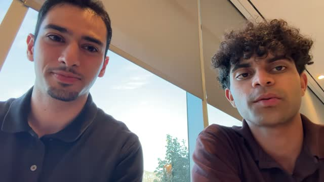
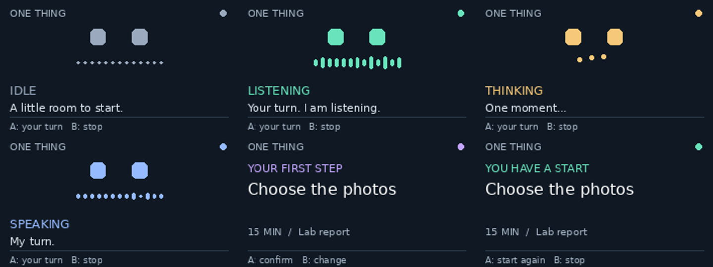
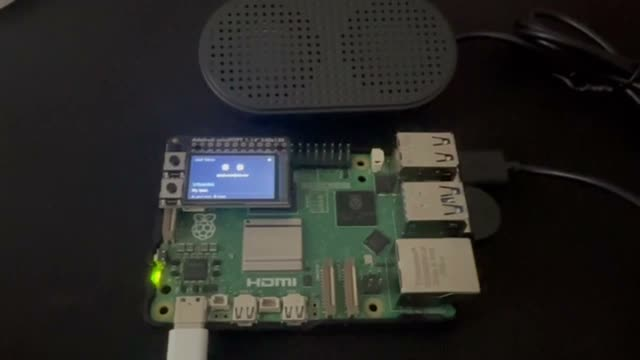
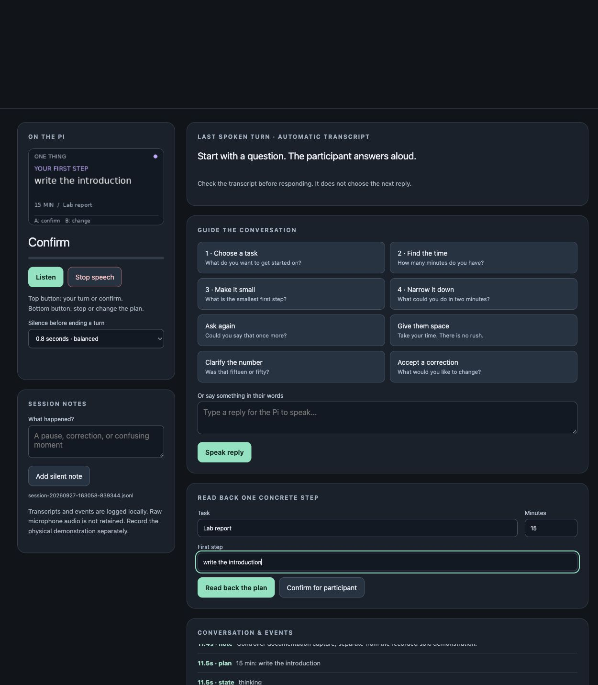

# Chatterboxes

**Ghaith Khalil and Aryan: One Thing**

One Thing is a voice desk companion for the moment when there is too much to do and nothing gets started. It asks what you want to work on, how much time you have, and what the smallest first step is. Then it stops talking so you can start. The conversation ends with one concrete thing to do, not a plan for the whole day.

## Prep

The project uses a Raspberry Pi 5 with a USB microphone and a USB speaker, set up following [prep.md](prep.md). Part 2 uses the USB microphone as its sensor and the Mini PiTFT from Lab 2 for turn-taking cues. The built-in screen buttons provide confirmation, correction, and stop controls.

```
cd ~/lab-hub/Lab\ 3
python3 -m venv --system-site-packages .venv && source .venv/bin/activate
pip install -r requirements.txt
./speech-scripts/setup.sh
```

The Pi detects the USB PnP Sound Device microphone and UACDemoV1.0 speaker. ALSA routes capture and playback to those devices by name, so the setup does not depend on their card numbers. Hardware checks completed on the Pi: Piper synthesized and played a setup message, the microphone returned 16,000 samples without overflow, and the controller initialized the Mini PiTFT and microphone together.

---

# Part 1

## A. Text to Speech

[greet.sh](greet.sh) greets each of us by name (`./greet.sh Ghaith`) with Piper (`en_US-lessac-medium`), streamed straight to the speaker so it starts talking before the whole sentence is synthesized:

> "Hello Ghaith. Let's find one small thing to start with today."

`./greet.sh Ghaith compare` plays the same greeting in espeak, festival, and then Piper.

**Is the same greeting, in these different voices, the same greeting?**

The literal request stays the same, but the delivery changes the role suggested by the device. A strongly synthetic voice frames "one small thing" as a system instruction, while a more conversational voice supports the intended role of a calm desk companion. That is why Piper is the design choice here. This is a design interpretation rather than a participant preference result.

The same greeting was generated and played through the Pi speaker with all three engines. Comparison samples: [espeak](audio/greeting-espeak.wav), [Festival](audio/greeting-festival.wav), and [Piper](audio/greeting-piper.wav). A live listener rating was not collected.

## B. Speech to Text

**Real-time factor for our own recording**

[Listen to the microphone recording](audio/own-speech.wav)

The recording is nine seconds long, including the short silence before and after the sentence. The intended sentence was: "I have fifteen minutes to work on my lab report. First, I will choose the photos."

Both models ran on the Raspberry Pi 5 with int8 computation and beam size 1. Timing excludes model loading and includes consuming the complete transcription result. Real-time factor is transcription time divided by the full nine-second recording.

| Model | Transcript | Transcription time | Real-time factor |
| --- | --- | --- | --- |
| tiny.en | I have 15 minutes to work on my lab report. First I'll choose the photos. | 1.271 s | 0.141 |
| base.en | I have 15 minutes to work on my lab report. First I will choose the photos. | 2.067 s | 0.230 |

**At what point does the accuracy improvement stop being worth the delay?**

For this recording, base.en took about 0.80 seconds longer without changing any information the device needs: both captured the task, fifteen minutes, and choosing photos. The only wording difference was "I'll" versus "I will." On this example, tiny.en is the better starting point for a responsive conversation. One recording does not establish that it is equally accurate for other voices, background noise, or corrections; those are cases to test before choosing a model for a finished device.

**Asking for a number:** [ask_number.py](ask_number.py) asks out loud, *"How many minutes do you have for one small task?"*, records until the answer ends (Silero VAD, 0.8 s of silence), transcribes it with faster-whisper, and reads the number it heard back to the person. Each answer is saved to `results/` as audio, plus a row in `numbers.csv` with the transcript and the number extracted from it. `--question` asks something else, for example a zip code.

The script lists every number in the answer instead of guessing one, so "ten... actually, fifteen" is saved as `10 15`. That is the kind of correction the device has to handle.

The fixed recording preserved "fifteen" as `15` in both models. In the live demo, however, the answer "Fifteen minutes" was reduced to "in minutes," losing the numerical information entirely. In a separate speaker-to-microphone replay, "fifteen" was transcribed as `50`. These examples show both omission and substitution errors. The original audio and a spoken readback are needed to distinguish those errors from the intended number. The solo demo used agreed plan values; it did not recover the missing number autonomously.

## C. Turn-taking

To hold the speech constant, the same nine-second microphone recording from Part B was replayed into Silero VAD at three silence thresholds on the Pi. Audio was supplied in 512-sample blocks at 16 kHz, with two seconds of trailing silence added so the last turn could finish. These are controlled replay measurements, not three live conversational trials or participant ratings. [Measurement data](media/turntaking-measurements.json).

| Minimum silence | Detected turns | End-of-turn decision, from recording start | Transcription time after detection |
| --- | --- | --- | --- |
| 0.2 s | 1 | 5.280 s | 1.015 s |
| 0.8 s | 1 | 5.856 s | 1.059 s |
| 1.5 s | 1 | 6.560 s | 1.001 s |

All three produced "I have 15 minutes to work on my lab report. First I will choose the photos." This recording did not contain a pause that caused the short threshold to split it. Moving from 0.2 to 1.5 seconds delayed the end-of-turn decision by 1.28 seconds without improving the transcript in this sample.

**At 0.2 s, what kinds of normal speech get cut off?**

A breath, hesitation, or pause before a correction can exceed 0.2 seconds. The design risk is committing to "ten" before hearing "actually, fifteen." That risk was not observed in the continuous sentence above and should not be inferred as a measured cutoff from this test. The controller therefore lets the wizard reopen listening and repair the plan.

**At 1.5 s, what does the delay make the system seem like?**

The extra wait gives someone more room to think, but leaves a noticeable interval before an answer can begin. Without a visible listening cue, that interval could be mistaken for a missed utterance. This is the design interpretation of the measured delay; a live subjective comparison is still uncollected. The prototype starts at 0.8 seconds and shows when it is listening versus waiting for a reply.

**The combined loop**

Using the 0.8-second replay, recognition took 1.059 seconds. Piper took another 0.557 seconds to produce the first audio chunk for the echo response. Adding the nominal 0.8-second endpoint threshold gives about 2.42 seconds before a response could start, excluding audio-device buffering and scheduling. This is a component-based estimate, not a measured live `echo_bot.py` conversation. In the actual prototype rehearsal, operation through chat added enough delay that the solo recording was repeated with a predetermined operator sequence. Faster turn selection helped, but did not make recognition autonomous.

## D. Storyboard

We considered three ideas: a speaking Pomodoro timer, a checklist reader, and a next-step coach. We chose the coach because it is the only one where speech does something a button can't. You can explain that you are unsure, change your mind, and correct a number mid-sentence.


| Scene | Person | Device |
| --- | --- | --- |
| 1. Stuck | Sits down at a desk covered in unfinished tasks. | "What is one thing you want to get started on?" |
| 2. Pick a task | "My lab report." | Waits for the whole answer, then asks how many minutes they have. |
| 3. Make it small | "Ten." | "What is the smallest first step you could take?" |
| 4. Confirm | "Write the first paragraph." | "Ten minutes to write the first paragraph. Does that sound right?" |
| 5. Correct | "Actually, photos first." | Repeats the corrected plan and asks again. |
| 6. Begin | Agrees and starts working. | "Ready when you are." Then stays quiet. |

### Dialogue, with pauses

**Device:** What is one thing you want to get started on?  
*[Wait for the answer, then 0.8 s of silence. If they seem to be thinking, keep waiting.]*  
**Person:** My lab report.  
**Device:** How many minutes do you have?  
*[Wait for the whole number, then 0.8 s.]*  
**Person:** Ten.  
**Device:** What is the smallest first step you could take?  
*[Long wait. This is the question people need to think about, so don't fill the silence.]*  
**Person:** Write the introduction... actually, choose the photos first.  
**Device:** Ten minutes to choose the photos. Does that sound right?  
*[Wait for yes or a correction.]*  
**Person:** Yes.  
**Device:** Ready when you are.

If there is no answer for about five seconds, the device says "Take your time" once and waits again. If the person says stop, it stops.

The 0.8 s pause is a starting guess, to be checked against Part C. The pause before the "smallest step" answer is intentionally longer than the others.

**Alternative branches**

- Unclear number: "Was that fifteen or fifty minutes?" Confirm instead of guessing.
- Step too big: "What could you do in just the first two minutes?"
- No task in mind: "Would you like to start with studying, chores, or something else?"
- Correction: repeat the corrected plan and confirm again.

**Process:** The design works backwards from the ending (the person starts working) to the least the device needs to know to get there: a task, the time available, and a first step. The alternative branches come from asking what could go wrong at each turn.


## E. Acting out the dialogue

We acted out the conversation together, with one of us asking the device's questions and the other responding with a task: starting work on a startup. The conversation moved from 20 minutes available to a smaller first step, writing down ten ideas, that would take ten minutes.

[](media/acted-dialogue.mp4)

[Watch or download the MP4](media/acted-dialogue.mp4) · [Original video on YouTube](https://www.youtube.com/watch?v=CZMEIBN0Yo8)

**Did the dialogue seem different than imagined, and how?**

The acted conversation was less rigid than the written script. Instead of immediately repeating the original time, the device role asked a follow-up about how long the proposed first step would take. That changed the plan from 20 minutes available to ten minutes for writing ideas. The distinction matters: available time and the time needed for the first step are not necessarily the same.

The conversation still reached a concrete action quickly, but the follow-up showed why the controller needs editable replies and a plan readback. A fixed sequence that blindly carries the first number forward would miss this adjustment. In the prototype, the wizard can ask a follow-up, change the plan's duration, and read it back before confirmation.

---

# Part 2

## Prep for Part 2

**1. What could be improved (wording, timing, misunderstandings)?**

The acted dialogue showed a distinction between time available and time needed for the first step: 20 minutes became ten after a follow-up. The revised interaction keeps the plan editable and reads it back before confirmation. The implementation also needed visible acknowledgement of a finished turn, a way to correct the plan, and a stop control that cancels pending work.

**2. Modes of interaction beyond speech: how does someone know when the device is listening and when it is thinking?**

The Mini PiTFT shows an animated face alongside explicit state labels. Listening uses mint green and microphone-responsive bars; thinking uses amber moving dots; speaking uses blue animated bars. Text keeps the states understandable without relying on colour. The face gives the device a consistent presence, while the listening meter indicates that sound is reaching the microphone.



*Interface renders from the same drawing code used on the Pi, not photographs of a user session.*

A separate confirmation screen shows the first step, the number of minutes, and the task. The top button confirms it, and the bottom button asks to change it. Outside confirmation, the top button opens a listening turn and the bottom button stops speech. A confirmed plan remains on screen so the user has something concrete to start with.

**3. Revised script**

This revision incorporates the adjustable time and follow-up from the acted dialogue, along with implementation checks. It has not been validated with two other participants.

| Moment | Device and screen | Person |
| --- | --- | --- |
| Start | Wizard selects the task prompt. Blue SPEAKING becomes green LISTENING. | Says what they want to work on. |
| End of turn | After 0.8 seconds of silence, the display changes to amber THINKING. The controller receives an automatic transcript. | Sees that their turn registered. |
| Time | Wizard asks how many minutes are available. | Gives a number, possibly with a correction. |
| Clarify | Wizard asks about an ambiguous number or distinguishes time available from time needed for the step. | Clarifies the intended time. |
| First step | Wizard asks for the smallest first step, or offers a smaller step if needed. | Chooses something concrete. |
| Readback | Device speaks the plan and displays a task card. | Top button confirms; bottom button requests a correction. |
| Correct | Device asks what should change. Wizard updates the plan and reads it back again. | Gives the correction aloud. |
| Finish | Device says "Ready when you are. One small step is enough." The plan stays visible. | Begins the task. |

The transcript is a suggestion for the wizard, not a command. A thinking pause can be handled with "Take your time" and a fresh listening turn. The silence threshold can be changed live between 0.2, 0.8, and 1.5 seconds for Part C. The microphone ignores the device's speech and a short settling period afterward to reduce self-transcription. The bottom button can interrupt playback; it also invalidates replies and transcripts already in progress.

## Prototype your system

[wizard.py](wizard.py) runs speech synthesis, microphone endpointing, transcription, button input, and the local web controller on the Raspberry Pi. [device_ui.py](device_ui.py) renders the Pi display and its browser preview. [controller.html](controller.html) is the wizard interface.

The controller provides preset questions, custom spoken replies, the latest transcript, plan fields, silent notes, and a timestamped event history. Speech is resampled to the USB speaker's supported 48 kHz output rate so playback works while microphone capture remains active. The wizard listens, checks the transcript, and chooses the next reply. No language model chooses the dialogue. Piper produces the voice, Silero detects completed turns, and faster-whisper tiny.en supplies transcripts locally.

| Behaviour | Control |
| --- | --- |
| Select the question or repair a misunderstanding | Wizard |
| Recognize speech and detect the end of a turn | Automatic |
| Animate the screen and show microphone activity | Automatic |
| Enter the task, time, and first step | Wizard |
| Speak and display the proposed plan | Automatic after the wizard submits it |
| Confirm or request a change | Participant buttons, or the wizard on their behalf |
| Stop playback and cancel pending work | Participant bottom button or controller Stop |

Hardware verification completed on the Pi: microphone endpointing and transcription, interruption during active speech, spoken plan readback reaching the confirmation state, confirmation reaching the ready state, and browser Listen/Stop controls. Invalid plans and out-of-order confirmations are rejected. The recorded demonstration also verified the physical bottom-button correction and top-button confirmation. Replaying a quiet recording through the speaker produced recognition errors, so automatic transcripts remain suggestions for the wizard.

### Running the prototype

Stop the prototype service before running the standalone Part A-C exercises so only one program uses the microphone: `sudo systemctl stop one-thing.service`.

On the Pi:

```sh
cd ~/lab-hub/Lab\ 3
sudo cp one-thing.service /etc/systemd/system/
sudo systemctl daemon-reload
sudo systemctl start one-thing
```

On the laptop, in a separate terminal:

```sh
ssh -N -L 5050:127.0.0.1:5000 pi
```

Open `http://localhost:5050`. The web server listens only on the Pi's loopback interface; the SSH tunnel connects the controller to it. The participant speaks to the Pi, while the wizard uses the laptop. Keyboard shortcuts 1 through 4 select the main prompts when a text field is not focused; Escape stops playback.

Each session writes `results/session-*.jsonl` with state changes, transcript text and timing, spoken replies, plan edits, button events, and notes. Raw microphone audio is not retained by this controller. The phone recording supplies the physical interaction evidence. The supplied service uses the Pi's `pi` account and `/home/pi/lab-hub/Lab 3` installation. `sudo systemctl stop one-thing` releases the microphone and screen; `sudo systemctl start window-clock.service` restores Lab 2. The Lab 3 service is installed but is not enabled at boot.

**Video of the system:** [Watch the 47-second demonstration](media/one-thing-demo.mp4).

[](media/one-thing-demo.mp4)

The recording shows the spoken task, time, and first step; the bottom-button correction; and the top-button confirmation of the revised plan. It is a scripted solo demonstration. To avoid delays from operating through chat, a predetermined operator sequence advanced after each recognized turn and submitted the agreed plan values. This was not autonomous interpretation of the conversation. [Timestamped events from this take](media/demo-events.jsonl) document the state transitions and button presses.

**Controller screencapture:** the live browser interface during a separate documentation walkthrough.



## Test the system

Testing with two other people has not been completed. The demonstration is a solo walkthrough.

| Participant | Video | Notes |
| --- | --- | --- |
| Solo demonstration | [Video](media/one-thing-demo.mp4) | Spoken plan, bottom-button correction, and top-button confirmation; not an independent user study. |

### What worked well about the system and what didn't?

The solo demonstration completed the full correction path: the first plan was to choose photos, the bottom button requested a change, and the top button confirmed the revised introduction step. The task card made the proposed action visible before committing. Both physical button events are present in the log.

Recognition was less reliable than the earlier fixed-recording comparison. During this take, the live transcript rendered "My lab report" as "of my library for it" and lost the number in "Fifteen minutes." The known demonstration script let the operator continue, but a general conversation would need a clarification instead. The recording also exposed a timing issue: LISTENING appeared before the short microphone settling period had finished, which could miss an immediate answer. After the recording, the code was changed to keep the speaking cue visible through that period and show LISTENING only when input is accepted. The video documents the version before this fix.

### What worked well about the controller and what didn't?

Preset replies, editable plan fields, and visible transcripts separate the wizard's decisions from the device's output. Stop cancels playback and invalidates pending replies, and the event log makes the conversation timing inspectable.

Operating every turn through chat was too slow in the first rehearsal. For the recorded take, the agreed sequence advanced as soon as each transcript arrived. This reduced operator delay but only demonstrates that specific script. It does not establish how quickly a wizard could handle an unexpected answer through the browser. The controller screencapture above documents that interface separately from the physical demonstration.

### What lessons can you take away from the WoZ interactions for designing a more autonomous version of the system?

The solo walkthrough highlights the gap between detecting a completed turn and understanding it. A future autonomous version needs separate representations for task, time, and first step, with explicit confirmation before accepting them. Missing or ambiguous numbers should trigger a question, not a guessed plan. Corrections should replace the relevant field and repeat the readback. The button path provides a clear way to correct or confirm a plan even when recognition is unreliable. These are implementation lessons from this walkthrough, not findings from an independent user study.

### How could you use your system to create a dataset of interaction? What other sensing modalities would make sense to capture?

The controller logs each device reply, automatic transcript, the end and duration of each detected spoken turn, plan edits, button events, and operator notes. With participant consent, a synchronized microphone recording and corrected transcript could establish the actual words and corrections, paired with the wizard's task and first-step annotations. Those annotations would support training and evaluating a dialogue policy. The logged screen-state timestamps help measure whether the visible cue matched the spoken turn. A camera could capture gestures and attention, but it would require separate consent and would collect more personal information than audio alone. The current logs contain automatic transcripts, which may be wrong; without the original audio, transcription errors cannot be checked afterward.

---

**Contributions:** AI assistance with planning and code. Speech scripts and setup from the [IRL-CT Lab 3 starter](https://github.com/IRL-CT/Interactive-Lab-Hub/tree/Fall2026/Lab%203). The screen driver is reused from Lab 2.
